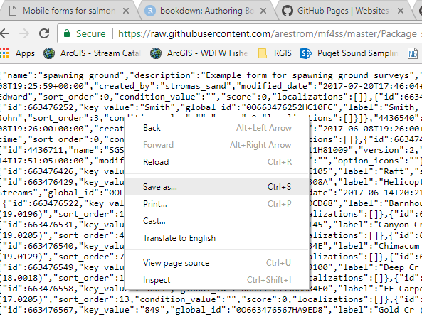
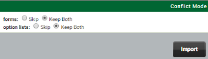

# Get started

The aim of this chapter is to provide a visual tour of what a spawning ground form built using the iFormBuilder platform *could* look like. Feel free to use the example form described below as a starting point that you can edit and adapt to your own protocols. The first section describes how to load the *example* spawning ground survey form to your profile. Then the following sections provide a guided tour of the parent *header* form and the *observations* subform. The focus is on design elements, and what is visible to the surveyor on the device. Technical details on how to build forms will be addressed in Chapter 3. 

## Import example form  

The quickest way to get started with mobile forms is by example.

1. Download the *Package_spawning_ground.json* file from the GitHub repository for this manual. To download, click on the [*Package_spawning_ground.json*](https://github.com/arestrom/mf4ss) link. You will see a list of files in the repository directory. Locate the *Package_spawning_ground.json* file in repository list and then click on the file. This will open a new window and display the contents of the file.

```{r echo = FALSE, fig.align = 'center', out.width = "50%"}
knitr::include_graphics("screenshots/package_json.png")
```

2. Click on the *Raw" button in the upper right-hand corner. This will fill your display with the raw contents of the file. 

```{r echo = FALSE, fig.align = 'center', out.width = "50%"}
knitr::include_graphics("screenshots/raw_json.png")
```

<br>

```{r echo = FALSE, fig.align = 'center', out.width = "50%"}

```

3. You can now right-click anywhere in your display and save the contents to a convenient location on your computer. In the *Save As* dialog the default name for the file will be *Package_spawning_ground.json.txt*. Accept the default and click *Save*. Then navigate to the location where you saved the file and edit the name to remove the *.txt* part. Windows will warn you not to do this, but do it anyway. You should end up with a file name of *Package_spawning_ground.json*.

4. Sign in to your iFormBuilder profile and click on the *Forms* tab, then click on *Form Packages > Package Import*. 

```{r echo = FALSE, fig.align = 'center', out.width = "25%"}
knitr::include_graphics("screenshots/package_dropdown.png")
```

5. In the *Package Importer* screen, click *Choose File*, navigate to where you downloaded the *Package_spawning_ground.json* file, and click *Import*. If you have existing forms in your profile **make sure** and select the **Keep Both** options in the *Conflict Mode* screen.

```{r echo = FALSE, fig.align = 'center', out.width = "45%"}

```

6. After you have imported the form click on the *Forms* tab, then *Form Assignment*. You should see two new forms: *spawning_ground_p* and *spawning_ground_s*. The trailing *p* indicates the *parent* form. The trailing *s* indicates the *subform*.

7. Highlight the row for *spawning_ground_s* then click *Assign* in the upper left corner. 

```{r echo = FALSE, fig.align = 'center', out.width = "35%"}
knitr::include_graphics("screenshots/form_assign.png")
```

8. Uncheck the boxes for *Collect* and *View*. Then scroll to the bottom and click *Update*. You should **never** have anything but the *parent form* assigned to users.  

9. Open the iFormBuilder application on your mobile device and log into the profile where you have saved your form. If you have done the preceeding steps correctly you should now see a form called *Spawning Ground Surveys* in the iFormBuilder application on your device. 

## A brief tour: Parent form

The parent form is where you would record information that only needs to be entered once per survey. This is typically the *header* information you would see at the top of a paper form. Any repeating lines of data (individual observations) will be entered to a subform. The sections below assume that you have a device loaded with the example *Spawning Ground* form. If not, please do so now, otherwise you will not be able to follow along with the examples described in the rest of this manual. 

### Hiding questions

After you have synced the *Spawning Ground* form to your device, click to launch. You should see a fairly bare form. The only items showing will be some basic header information. Items include a multiselect dropdown widget for *Observers*, a set of select buttons for *Data entry real-time or post-survey*,  a *Survey start date & time* widget, a set of *Survey method* select buttons, a dropdown widget for *Stream*, and a *Done* button. The reason that you only see a few input elements at first is that we have hidden the others using conditional logic. Hidden inputs will only be revealed after prerequisite fields have been filled out. Selectively hiding input elements in a form is a highly effective tool for reducing clutter and simplifying form structure. 

### Required fields

Note the asterisks next to the labels for each input element. This indicates *required* fields. If you fail to fill any of these out you will be reminded when you hit the *Done* button. You will not be allowed to save or submit your data until all required fields are filled in. 

### Real-time or post-survey

The *Data entry real-time or post-survey* field illustrates how you can set up rules to show or hide input elements in your form based on an initial conditions. For example, if you have some old data to enter from paper forms and you would like to use the mobile form as a post-survey data entry screen, then we know we don't need to show widgets for recording GPS locations at a later stage. In addition, we probably won't need to show widgets for capturing barcodes, or taking pictures. These can all be hidden if the data entry type is set to `Post-survey`. 

### Default values

Notice that for the *Data entry real-time or post-survey* and *Survey method* inputs we have pre-selected default values of *Real-time* and *Foot* respectively. For *Survey start date & time* we can set a default value of the current date and time by using a JavaScript function `new Date()`. Setting default values is a good way to help speed up data entry in the field. Details on how to set this up is included in Chapter 3. 

### Filtered option lists

The *Stream*, *Survey start point* and *Survey end point* input elements demonstrate use of filtered option lists. Click on *Stream* and you will see a list of stream names. Start and stop points for stream *reach* sections that are typically surveyed are displayed. These are filtered to the stream you select. If you change the *Stream* selection, a different set of start and stop points options will be displayed. Select *Bear Cr (19.0196)* to see a good example of using labels to help identify filtered options. If you now click on the *Survey start point* pick list you will see a simple set of descriptions for the filtered points. 

At the bottom of each option list for start and stop points you have the ability to enter *Not listed above*. If you select this option two additional form input elements will appear where you can enter the approximate river mile of the location and a description of the location. Ideally, all reach end points that you normally survey will already be entered to your option lists. New points can easily be added, even to a live form, but for those rare cases where the unexpected happens, it is sometimes a good idea to provide options for manual entry. Keep this to a minimum though, as it can quickly make a form overly complex and unwieldy.  

### Data validation

For an example of data validation, click on the *Water temperature (degree C)* widget and enter the number `45`, then click the *Done* button. You should see a message pop-up that says *The start point water temperature must be between 0 and 38 degrees Celsius*. These types of validations are simple to set up. Details will be provided in Chapter 3. 

### Automated entry of zero counts

The *Target species* multiselect widget is intended as an automated way to enter zero counts for cases where you are actively surveying for a given species but do not see any. For example, if your survey is specifically targeted for Coho and Chinook, and your survey will be used to calculate population estimates, entering zero counts is crucial. By entering Coho and Chinook as target species, a zero count can automatically be entered on the backend for these species in case none are seen. The alternative would be to manually enter a count of zero for each species targeted. Automating the process of entering zero counts can help speed up data entry in the field. 

The follow-up question below asks you to specify the *categories* of counts where zeros should be entered. Depending on the type of survey, this question allows you to specify if zero counts should be entered for fish counts, redds counts, or both. If you are strictly conducting a redd survey you would only want zeros entered for redds. If you are only doing a carcass survey, you will want to specify *Fish only*. If you are conducting a complete survey, including redd, live, and carcass counts, you will want zero counts entered for *Both fish and redds*.

### Toggling a subform

The final header data question in the top section asks *Did you see any fish or fish redds?*. If you answer *Yes* a subform will become visible where you can enter each observation. If you answer *No* you will only need to fill in a few remaining post-survey questions. To complete the questions on the parent form click *No* to this question.

### Survey comments and dynamic labels

In the bottom portion of the parent form you are asked to enter some *canned* pick-list comments regarding *Stream flow, Visibility conditions, and Weather*. The new *spawning ground* database provides many additional options for *canned* comments adapted from legacy *condition codes* that you may have used in the past. See the *spawning_ground* database [*Data Dictionary*](https://arestrom.github.io/sgsdd/#survey_comment) for a full list of these comments. Comment descriptions are listed in the look-up tables linked to the *survey_comment* table.  

You are next asked if the survey was completed. If not, then you are asked to explain why. Toggle between answering *Completed survey* and any other option. Notice that the label for the *Survey comments* field will change from *(optional)* to *(required)*. In addition, a note will appear reminding you that an explantion is needed. This is a good example of using *Dynamic lables*. Additional details will be provided in Chapter 3.

### Setting optional fields to required

The final two questions allow you to enter general comments on the survey, and the time the survey was finished. Both questions are technically set as optional, but remember that you will still need to enter an explanation if you did not answer *Completed survey* above. This demonstrates how optional fields can conditionally be set to required, without explicitly toggling the *Required* setting when building the form.  

## A brief tour: Observations subform

Go back to the question *Did you see any fish or fish redds?* and click *Yes*. The *Observation subform* will be displayed. Click on the *Observation subform* to allow entering counts of fish, redds and any ancillary information. 

After opening the subform you will need to specify if the *Observation type* was for live fish, dead fish, or redds. Depending on your answers a different set of questions will be displayed. After you enter *Observation type* and *Species* toggle between *Fish redd* and the other two options in *Observation type* to see how the questions near the bottom of the screen vary. 

The initial set of questions after selecting *Observation type* and *Species* will be identical. They will ask about *Run year*, and *Survey type*. Each of these are core questions that are required in the form, and must be anwered in order to enter the data to our corporate database. 

In our example, *Run year* is set to the current year. You could also use JavaScript to auto-generate different values depending on species and current date. Or you can manually edit *Run year* as needed. 

*Survey type* can vary depending on species and survey protocol. This is why survey type is included at the subform level. For example, during a fall Chinook *index* survey, Pink salmon encounters may need to be entered as *supplemental*. 

Note that depending on the species selected, the text for subsequent questions will be altered to include the species name. This is another example of *Dynamic labels*.

### Live fish

Go back to *Observation type* and select *Live fish*, then select *Chinook* as *Species*. A relatively simple set of form inputs will be displayed. After you enter a *count* of how many fish you saw you will see options to enter the *location*, along with *Sex and maturity* and *Adipose clip status*. Enter some arbitrary values for these fields and click the *Done* button. As soon as the form saves the record it will cycle right back to the start of the *Observation subform* and you can enter the next observation. The ability of the subform to cycle back to the start after saving a record is a feature you can specify when designing the form. It is called `SUBFORM_BATCH_MODE`. Details will be provided in Chapter 3. 

Notice also that the form is *sticky* in the sense that after you press the *Done* button, it remembers the *Species* and *Survey type* you entered last, and initiates the next observation with the values you used most recently. This *stickiness* can be useful if you typically encounter the same species repeatedly during a survey. Chapter 3 will detail how to code this behavior in the *dynamic value* box of a field. 

Change the *Species* to *Pink* and notice that the option to enter *Adipose clip status* dissapears. Using conditional logic you can first make a list of the species likely to have clipped fins, and then only display the *Adipose clip status* question when one of those species is encountered.

### Carcass

Click the *Done* button and cycle back to the top of the subform to enter a new observation. This time select *Carcass* as the *Observation type* and *Chinook* as the *Species*. The initial set of questions will look the same as for live fish. But if you enter a count of `2` or more for the *Number of Chinook counted* you will see a note reminding you that you must enter a count of `1` if you also want to enter additional biological data that is typically associated with individual fish, such as spawn condition, length measurements, or scale samples. This forces data for individual fish to be entered one fish at a time to our corporate database. If otoliths, or tissue samples for DNA analaysis are taken, the form will also assign a unique ID (UUID) that allows a single fish to be tracked in our data systems as a unique entity.

If you now edit the *Number of Chinook counted* and enter `1`, you will see a question appear asking: *Did you take a sample?*. If you select either *Otolith* or *Tissue* a UUID will be generated in a hidden field. You are also given the option to manually enter a *Sample number*. This will be appended to the front of the UUID and enables additional flexibility in tracking individual fish and sample numbers.

If you enter either *Beep* or *No beep* in the *Did you detect a CWT in the Chinook?* a new question will appear asking what *Detection method* you used. Also, if you selected *Adult female* or *Sub-adult female* for the *Sex and maturity* question, you will be asked an optional question regarding *Spawn condition* of the fish. 

Length measurements are sometimes required when tissue samples are taken for DNA analyses. In our example form you will be asked to enter a fish length if you select either *Otolith* or *Tissue* for the *Did you take a sample?* question. If you enter a length you will also be asked what type of length measurement was taken. As always, both the selection of length types, and the triggers for when this question is asked, can be customized to your individual survey protocols. 

Go back to *Number of Chinook counted* and edit your answer to a number greater than one. You will still have the ability to enter a location for where you saw the group of fish. You can also enter *Sex and maturity*, *Adipose clip status*, and whether you detected coded-wire tags in the group of fish. If you answer *Beep* or *No Beep* to the question *Did you detect a CWT in the Chinook* you will also be asked about *Detection method*. However, if you detected a coded-wire tag (CWT) and need to record a *CWT head label number* you will be required to enter this on an individual basis. You will only have the ability to enter a *CWT head label number* if the *Number of Chinook counted* is `1`.  

### Fish redd

Click the *Done* button and cycle back to the top of the subform to enter a new observation. This time select *Fish redd* as the *Observation type* and *Steelhead* as the *Species*. Once again the first set of questions look similar, but you will now be asked to enter the *Number of redds observed*. If you enter a count greater than zero, you will also be asked to enter a *Redd location*. Notice that we have now set the *Redd location* question to required, as indicated by the asterisk. After you enter the location a hidden field will be generated in the background that will include only the latitude and longitude portions of the location output. For example:

```
47.065892: -122.887961
```
This is a good example of how you can pull out just the parts you need from a given data input element and combine those parts in arbitrary ways to generate custom data elements. Details on how to create this input element is included in Chapter 3.   

If you enter a count greater than zero for *Number of redds observed* you will also be asked about *Redd status*. The typical options will be listed for selection, but if your protocols require additional categories, those can easily be added. 

You will also be asked if there were *Any live Steelhead associated with the redd?*. If you answer *Yes* you will then have the option to enter the number of Steelhead seen, the *Sex and maturity*, and the *Adipose clip status* of the live steelhead. 

Unlike the restrictions applied to carcass data, there are no requirements to enter data for redds on an individual basis. However, if you wanted to add questions to your form that typically require individual entries, such as redd shape, tailspill height, or substrate type, then you would need to condition those question on *Redd count* and only show these question if the count was one. 

## Additional options

The example survey form described above includes most of the basic input elements that would typically be needed for spawning ground surveys. Although the form has intentionally been kept simple to illustrate basic concepts, other data inputs can easily be added. Questions regarding items such as gill condition, egg retention, marks or tags, would be trivial to implement. The relatively simple structure, consisting of one parent form and one subform, is sufficient to incorporate many additional data input elements. You always have the option to add more subforms, but keep in mind that the simpler the structure of the form, the simpler it is build and maintain. It can quickly become challenging to reason about conditional logic when multiple subforms are involved. At that point you may find you need to pass hidden values back and forth between parent and multiple subforms. As a general rule, simpler is nearly always better. 

Before you add new data input elements to your mobile form please take a look at the *spawning_ground* database [*Data Dictionary*](https://arestrom.github.io/sgsdd/). This document lists the full range of data elements available to be incorporated into mobile forms. Feel free to contact me if you have any questions, or find that there are data elements you want to record that do not appear to exist in the *spawning_ground* database.


