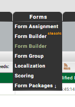
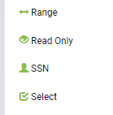
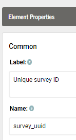
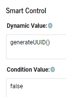
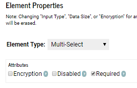
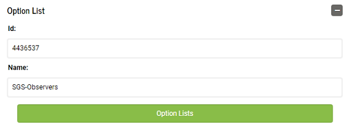
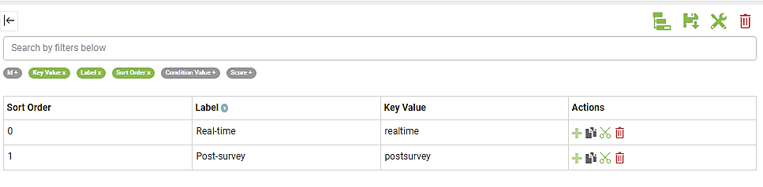

# Build a form

The sections below use the [*Package_spawning_ground.json*](https://github.com/arestrom/iFormBook) example form to illustrate how to build a mobile form on the iFormBuilder platform. If you have not done so already, please see the instructions in chapter 2 to load this package to your profile. Then open the iFormBuilder web interface, click on *Forms > Form Builder > spawning_ground_p* to load the example form. 

```{r echo = FALSE, fig.align = 'left', out.width = "20%"}

```

Chapter 2 dealt with how the example *spawning_ground* form appeared on the mobile device. In Chapter 3 the focus shifts to the iFormBuilder web interface and details how data elements can be defined, validated, conditionally hidden, and assigned default values. 

There will be special emphasis below on the core data elements that need to be present in any mobile form intended to be submitted to our corporate spawning ground database. If a core element is missing it will not be possible to upload any of the data from your mobile form to our central database.  

## Survey ID (core element)

The first element in the parent form of any mobile form used for spawning ground surveys should be a *unique survey ID*. Although iFormBuilder has a widget titled *Unique ID* this is not a good choice for our purposes. The iFormBuilder *Unique ID* widget is merely a combination of a constant prefix and an integer value that increments each time you start filling out a new form. For example, D16-1, D16-2, etc. 

The reason that iFormBuilder's solution is not a good choice is that it may result in generating IDs that conflict over time. For example, if after a season of using a form you decide to amend the structure, retire the old form and deploy the new version, you may end up with identical IDs for different surveys unless you also make sure to edit the prefix to some value never previously used. An alternate scenario is that you may want to create dedicated forms for different types of surveys, such as for fall Chinook, or spring Steelhead. To enfore uniqueness statewide there would need to be coordination in assigning prefixes over WDFW districts and regions, otherwise new forms may start incrementing overlapping IDs.  

An even more important reason for adding a truly unique survey ID element to our forms is that it can then be used as a primary key in our corporate database. To that end what we need is a unique identifier that is (virtually) guaranteed to always be unique. The solution is to use a random uuid (universally unique ID). A version 4 uuid can be generated using the JavaScript code below. See the following link at [Stackoverflow](https://stackoverflow.com/questions/105034/create-guid-uuid-in-javascript) for the source of the function.  

```{js, eval = FALSE}
function generateUUID () { // Public Domain/MIT
    var d = new Date().getTime();
    if (typeof performance !== 'undefined' && typeof performance.now === 'function'){
        d += performance.now(); //use high-precision timer if available
    }
    return 'xxxxxxxx-xxxx-4xxx-yxxx-xxxxxxxxxxxx'.replace(/[xy]/g, function (c) {
        var r = (d + Math.random() * 16) % 16 | 0;
        d = Math.floor(d / 16);
        return (c === 'x' ? r : (r & 0x3 | 0x8)).toString(16);
    });
}
```

You can copy and paste this function directly into the JavaScript panel of your parent form. To access the JavaScript panel click on the curly braces icon <span style="color:#89BD48; font-size: 1.2em;">{}</span> in the top right corner of the Forms page when using the online Form Builder application.


```{r echo = FALSE, out.width = "25%"}
knitr::include_graphics("screenshots/actions.png")
```

Make sure you paste the function into the JavaScript panel for your *parent* form, not the *subform*. 

You can then go back to the form builder interface and create a read-only element in your parent form by clicking on the *Read Only* widget in the left-hand pane. 

```{r echo = FALSE, fig.align = 'left', out.width = "20%"}

```

The name of the element in the *Element Properties* pane on the right-hand side should be `survey_uuid`. Enter `Unique survey ID` as the label. 

```{r echo = FALSE, fig.align = 'left', out.width = "20%"}

```

In the *Dynamic Value* box in the *Element Properties* pane on the right-hand side enter the following: 

```{js, eval = FALSE}
generateUUID() 
```

Leave the *Condition Value* set to `false`. That way it will be invisible to the surveyor. 

```{r echo = FALSE, fig.align = 'left', out.width = "20%"}

```

The `survey_uuid` element will generate a universally unique ID every time a form is initiated that will look something like: 

```
33b78489-7ad3-4482-9455-3988e05bfb28
```

There are 2^122^ possible combinations for a randomly generated version 4 uuid. In practical terms this means that if you generate one billion UUIDs every second for approximately 85 years, the probability that two identical UUIDs will be generated is still only about 50%. See article at [Wikipedia](https://en.wikipedia.org/wiki/Universally_unique_identifier). 

## Data source (core element)

Click on the *Data source* label in the form view on the left-hand side of the form-builder pane. Then examine the *Element Properties* in the right-hand pane. The `data_source` element will typically be another read-only field. It can be hard-coded as `"wdfw"` in the *Dynamic Value* box of the Smart Control. You can set the *Condition Value* to `false` to hide it from view. On the off-chance that your form will be shared with other organizations, you can also change this element to a select widget. You will then need to create an option list that includes all organizations using the form. Examples of how to create option lists and use select values are provided in the sections below. For now, let's just assume `data_source` will be a hidden, read-only data element. 

## Observers

Click on *Observers* in the form view. Although `observers` is not a core required element it is highly recommended that you include this multi-select widget. In the example form it has been set to *Required* in the *Attributes* section of the *Element properties* pane. 

```{r echo = FALSE, fig.align = 'left', out.width = "40%"}

```

Click on the green *Option lists* button to see the observers currently listed. A screen will appear that allows you to assign option lists to data elements. 

```{r echo = FALSE, fig.align = 'left', out.width = "60%"}

```

Multi-select widgets allow you to select one or more of the options listed. If more than one is selected the last names (Key Value) will be concatenated together, separated by commas and a space. 

## Data submitter

The `data_submitter` element is another hidden field that is not required, but good practice to include. The `data_submitter` value is auto-generated in the background, and identifies the person who was logged into the mobile device when the the survey *Done* button was clicked. The data are derived from default meta-data fields provided by iFormBuilder. To create this element you click on the *Text* widget in the left-hand sidebar and check the *Read-Only* box in the *Attributes* section of the *Element Properties* box on the right-hand side. In the *Dynamic Value* box of the *Smart Control* pane, enter:

```{js, eval = FALSE}
iformbuilder.lastName
```

There are several built-in functions you can use to generate data such a this. See the [JavaScript Tips and Tricks](https://iformbuilder.zendesk.com/hc/en-us/articles/201697610-Overview-of-the-Built-in-iFormBuilder-Functions) section for additional examples of how these built-in functions can be used. 

To hide this field so it does not clutter up your display when conducting a survey, you can set the *Condition Value* to `false`. 

## Entry method

The *Data entry real-time or post-survey?* field allows for selectively hiding or showing fields depending on the method used to record data in the field; whether on a mobile device, or on paper. There may be occasions where you need to enter data that was originally recorded on paper. In this case, fields for capturing GPS locations, barcodes, or images would be largely irrelevant. The two options are: `Real-time` or `Post-survey`. 

Click on the green *Option Lists* bar in the *Option List* box to see how these options are structured. 

```{r echo = FALSE, fig.align = 'left', out.width = "100%"}

```

Notice the *Sort Order* column in the option list. You can use these values to specify a default answer to display. If you enter `0` in the *Dynamic Value* box the default value will be `Real-time`, entering `1` would set the default value to `Post-survey`. If you do not want to set a default value you can enter `-1`. Setting a dynamic value of `-1` is an explicit way to say the value is currently missing. It is good practice to always initialize select, multi-select, or pick-list widgets with either a default value or `-1`. 

Another way to set default values is to reference either the option list *Label* or *Key Value* instead. You would simply preface the field name with `ZCDisplayLabel` or `ZCDisplayKey`. For example, `ZCDisplayLabel_species` or `ZCDisplayLabel_redd_status`. 

In the case of simple lists such as `entry_method` using *Sort Order* as a reference is acceptable. There are only two values to remember. For more more complex cases, however, where there are many options, and possibly conditional logic tied to those option values, it is nearly always better to reference the *Label* or *Key Value* instead. The reason is that you are then constructing logical statements with actual understandable names rather than just numbers. For example, once your brain gets past the ugly `ZCDisplayKey` portion, it's much easier to understand statements such as: 

```{js, eval = FALSE}
if(ZCDisplayKey_species == "coho" && ZCDisplayKey_redd_status == "new_redd") {"Yes"} else {"No"}
```

Rather than:

```{js, eval = FALSE}
if(species == 3 && redd_status == 0) {"Yes"} else {"No"}
```

Aside from not having to remember the `sort_order` values in order to understand what is actually being stated, using *Key Values* or *Labels* also avoids having to change the statements if you later need to edit the option list and inadvertantly shuffle the `sort_order` values assigned to each option.

## Survey start date (core element)

The `survey_start_datetime` field is a core element. There are several methods to add a date or date-time field to your form. The example form shows perhaps the most common method, but see the: [JavaScript Tips and Tricks](https://iformbuilder.zendesk.com/hc/en-us/articles/201697830-Adding-Date-and-TimeStamps-to-a-Form) section for alternative methods. Because it is a core field, and it is not hidden, you will need to check *Required* in the *Attributes* box of *Element Properties*. Note also that the *Dynamic Value* is generated using a JavaScript function: 

```{js, eval = FALSE}
new date()
```

## Survey method (core element)

Edit how to edit option lists....

The `survey_method` field is another core element. If you click on the green *Option Lists* bar the *Assign Option Lists* window will open and you will see there are only three options listed: `Foot`, `Raft`, and `Helicopter`. Several additional options that you may want to add are listed in the *SpawningGroundDataDictionary* mentioned in chapter 2. 

If you need to add an option, for example `Snorkle`, close the *Assign Option Lists* window and click on *Option Lists* in the top left-hand corner of the form builder application. 

```{r echo = FALSE, out.width = "50%"}

```

A window showing all option lists in your profile will open. Scroll down to the `SGS-SurveyMethod` option list and click on it. This will open a new window where you can veiw and edit the `SGS-SurveyMethod` list. Next, click on the green plus sign at the bottom of the *Actions* column on the far right. A new row will appear, and a new sequential `sort_order` number will be automatically assigned. You can then enter `Snorkle` in the *Label* column, and a lower case `snorkle` in the *Key Value* column. The *Key Value* name should always be in lower case. Underscores should be used for compound names, such as `new_redd`. Don't forget to click the **Save** icon before closing the *Option Lists* window. 

Notice that the default value for **survey_method** has been set to `0 (Foot)` in the *Dynamic Value* box. Since most spawning ground surveys tend to be `foot` surveys, this setting allows you to quickly skim by this element when entering header data. If you prefer to manually select a `survey_method` each time, you can set the *Dynamic Value* to `-1` instead. 

## Stream (core element)

As mentioned in Chapter 2, you must select a `stream` before any additional fields in your example form become visible. You will then be able to select start and end points for your survey along the selected stream. Only points belonging to the stream you select will be visible. This is an example of a filtered option list. 

If you click on the green *Option List* bar for the `stream` element and scroll through the option lists on the left-hand side of the pop-up window, you will see an `SGS-Streams` option list and a `SGS-StreamLocations` option list. There are 38 options in the `SGS-Streams` list, and 210 options in the `SGS-StreamLocations` list. Option lists for streams and locations in your area may end up being longer. Given the number of elements involved you will want the *Element Type* to be a *Pick List*. 

Close this pop-up window and select *Option Lists* in the upper left-hand corner of the *Form Builder* page. 

```{r echo = FALSE, out.width = "50%"}

```

Scroll down and click on `SGS-Streams` to see how this option list is defined. One defining feature of option lists is that the *Key Values* must all be unique. For this reason you do not want to use the stream name as the key value. There can be multiple Boulder Creeks, or Cedar Creeks within a given watershed. Using the Stream Catalog Code (i.e. 17.0213) is also problematic since there are areas in the state where smaller streams may not have been assigned a code. The solution is to use the unique integer ID from the old Spawning Ground Survey (SGS) database for the *Key Value*. 

Next, click on *Option Lists* again and select `SGS-StreamLocations`. The first entry has a *Label* that lists the river mile of the point, along with a short description: `RM 0.00: Mouth`. This is the part that will be visible when using the form. The *Key Value* is a combination of the integer ID of the stream combined with an underscore separator and finally the river mile formatted to three digits before the decimal and two digits after the decimal. This ensures that the *Key Value* will always be unique and of consistent length. 

To see how this list is filtered by stream click on the gray *Condition Value* button in the upper-left hand corner of the option list. 

JavaScript ordering from zero

Difficulty creating lists

iformr and API

Uniqueness and key_value scheme


