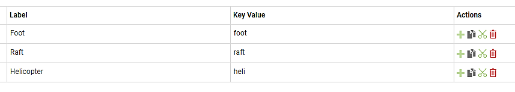
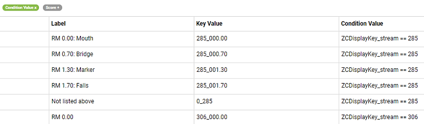
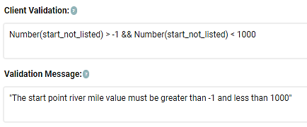
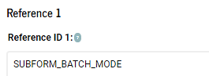

# Build a form

The sections below use the [*Package_spawning_ground.json*](https://github.com/arestrom/mf4ss) example form to illustrate how to build a mobile form on the iFormBuilder platform. If you have not done so already, please see the instructions in **Chapter 2** to load this package to your profile. Then open the iFormBuilder web interface, click on *Forms > Form Builder > spawning_ground_p* to load the example form. 

```{r echo = FALSE, fig.align = 'left', out.width = "20%"}
knitr::include_graphics("screenshots/forms_dropdown.png")
```

Chapter 2 provided a high level tour of the example *spawning_ground* survey form the perspective of the end-user. The focus was on the appearance and behavior of the data input elements that a user would encounter on the mobile device. In Chapter 3 the focus shifts to the iFormBuilder web interface and dives into mobile form construction techniques. Details will be provided on how data input elements can be defined, validated, conditionally hidden, and assigned default values. 

There will be special emphasis below on the core data inputs that need to be present if data from a mobile form is intended for submission to our corporate spawning ground database. If a core input element is missing it will not be possible to upload any of the data from your mobile form to our central database.

## Parent form

The parent form contains data input elements that you would typically only enter once per survey. Fields such as surveyor names, the stream and stream reach you are surveying, or the survey date, are typical parent form data. These are the header fields that you would normally see at the top of a paper form.  

### Survey ID (core input element)

The first input in the parent form of any mobile form used for spawning ground surveys should be a *unique survey ID*. Although iFormBuilder has a widget titled *Unique ID* this is not a good choice for our purposes. The iFormBuilder *Unique ID* widget is merely a combination of a constant prefix and an integer value that increments each time you start filling out a new form. For example, `D16-1, D16-2`, etc. 

The reason that iFormBuilder's solution is not a good choice is that it may result in generating IDs that conflict over time. For example, if after a season of using a form you decide to amend the structure, retire the old form and deploy the new version, you may end up with identical IDs for different surveys unless you also make sure to edit the prefix to some value never previously used. An alternate scenario is that you may want to create dedicated forms for different types of surveys, such as for fall Chinook, or spring Steelhead. To enfore uniqueness statewide there would need to be coordination in assigning prefixes over WDFW districts and regions, otherwise new forms may start incrementing overlapping IDs.  

An even more important reason for adding a truly unique survey ID input element to our forms is that it can then be used as a primary key in our corporate database. To that end what we need is a unique identifier that is (virtually) guaranteed to always be unique. The solution is to use a random uuid (universally unique ID). A version 4 uuid can be generated using the JavaScript code below. See the following link at [Stackoverflow](https://stackoverflow.com/questions/105034/create-guid-uuid-in-javascript) for the source of the function.  

```{js, eval = FALSE}
function generateUUID () { // Public Domain/MIT
    var d = new Date().getTime();
    if (typeof performance !== 'undefined' && typeof performance.now === 'function'){
        d += performance.now(); //use high-precision timer if available
    }
    return 'xxxxxxxx-xxxx-4xxx-yxxx-xxxxxxxxxxxx'.replace(/[xy]/g, function (c) {
        var r = (d + Math.random() * 16) % 16 | 0;
        d = Math.floor(d / 16);
        return (c === 'x' ? r : (r & 0x3 | 0x8)).toString(16);
    });
}
```

You can copy and paste this function directly into the JavaScript panel of your parent form. To access the JavaScript panel click on the curly braces icon <span style="color:#89BD48; font-size: 1.2em;">{}</span> in the top right corner of the Forms page when using the online Form Builder application.


```{r echo = FALSE, out.width = "25%"}
knitr::include_graphics("screenshots/actions.png")
```

Make sure you paste the function into the JavaScript panel for your *parent* form, not the *subform*. 

You can then go back to the form builder interface and create a read-only input element in your parent form by clicking on the *Read Only* widget in the left-hand pane. 

```{r echo = FALSE, fig.align = 'left', out.width = "20%"}
knitr::include_graphics("screenshots/read_only_widget.png")
```

The name of the input element in the *Element Properties* pane on the right-hand side should be `survey_uuid`. Enter `Unique survey ID` as the label. 

```{r echo = FALSE, fig.align = 'left', out.width = "20%"}
knitr::include_graphics("screenshots/label_name.png")
```

In the *Dynamic Value* box in the *Element Properties* pane on the right-hand side enter the following: 

```{js, eval = FALSE}
generateUUID() 
```

Leave the *Condition Value* set to `false`. That way it will be invisible to the surveyor. 

```{r echo = FALSE, fig.align = 'left', out.width = "20%"}
knitr::include_graphics("screenshots/dynamic_value.png")
```

The `survey_uuid` element will generate a universally unique ID every time a form is initiated that will look something like: 

```
33b78489-7ad3-4482-9455-3988e05bfb28
```

There are 2^122^ possible combinations for a randomly generated version 4 uuid. In practical terms this means that if you generate one billion UUIDs every second for approximately 85 years, the probability that two identical UUIDs will be generated is still only about 50%. See article at [Wikipedia](https://en.wikipedia.org/wiki/Universally_unique_identifier). 

### Data source (core input element)

Click on the *Data source* label in the form view on the left-hand side of the form-builder pane. Then examine the *Element Properties* in the right-hand pane. The `data_source` element will typically be another read-only field. It can be hard-coded as `"wdfw"` in the *Dynamic Value* box of the Smart Control. You can set the *Condition Value* to `false` to hide it from view. On the off-chance that your form will be shared with other organizations, you can also change this input element to a select widget. You will then need to create an option list that includes all organizations using the form. Examples of how to create option lists and use select values are provided in the sections below. For now, let's just assume `data_source` will be a hidden, read-only data element. 

### Observers

Click on *Observers* in the form view. Although `observers` is not a core required input it is highly recommended that you include this multi-select widget. In the example form it has been set to *Required* in the *Attributes* section of the *Element properties* pane. 

```{r echo = FALSE, fig.align = 'left', out.width = "35%"}
knitr::include_graphics("screenshots/observer_required.png")
```

Click on the green *Option lists* button to see the observers currently listed. A screen will appear that allows you to assign option lists to data input elements. 

```{r echo = FALSE, fig.align = 'left', out.width = "60%"}
knitr::include_graphics("screenshots/option_list_box.png")
```

Multi-select widgets allow you to select one or more of the options listed. If more than one is selected the last names (Key Value) will be concatenated together, separated by commas and a space, for example, `Smith, Jones, Nelson`. 

### Data submitter

The `data_submitter` input is another hidden field that is not required, but good practice to include. The `data_submitter` value is auto-generated in the background, and identifies the person who was logged into the mobile device when the the survey *Done* button was clicked. The data are derived from default meta-data fields provided by iFormBuilder. To create this input you click on the *Text* widget in the left-hand sidebar and check the *Read-Only* box in the *Attributes* section of the *Element Properties* box on the right-hand side. In the *Dynamic Value* box of the *Smart Control* pane, enter:

```{js, eval = FALSE}
iformbuilder.lastName
```

There are several built-in functions you can use to generate data such a this. See the [JavaScript Tips and Tricks](https://iformbuilder.zendesk.com/hc/en-us/articles/201697610-Overview-of-the-Built-in-iFormBuilder-Functions) section for additional examples of how these built-in functions can be used. 

To hide this field so it does not clutter up your display when conducting a survey, you can set the *Condition Value* to `false`. 

### Entry method

The *Data entry real-time or post-survey?* field allows for selectively hiding or showing fields depending on the method used to record data in the field; whether on a mobile device, or on paper. There may be occasions where you need to enter data that was originally recorded on paper. In this case, fields for capturing GPS locations, barcodes, or images would be largely irrelevant. The two options are: `Real-time` or `Post-survey`. 

Click on the green *Option Lists* bar in the *Option List* box to see how these options are structured. 

```{r echo = FALSE, fig.align = 'left', out.width = "100%"}
knitr::include_graphics("screenshots/real_post.png")
```

Notice the *Sort Order* column in the option list. You can use these values to specify a default answer to display. If you enter `0` in the *Dynamic Value* box the default value will be `Real-time`, entering `1` would set the default value to `Post-survey`. If you do not want to set a default value you can enter `-1`. Setting a dynamic value of `-1` is an explicit way to say the value is currently missing. It is good practice to always initialize select, multi-select, or pick-list widgets with either a default value or `-1`. 

Another way to set default values is to reference either the option list *Label* or *Key Value* instead. You would simply preface the field name with `ZCDisplayLabel` or `ZCDisplayKey`. For example, `ZCDisplayLabel_species` or `ZCDisplayLabel_redd_status`. 

In the case of simple lists such as `entry_method` using *Sort Order* as a reference is acceptable. There are only two values to remember. For more more complex cases, however, where there are many options, and possibly conditional logic tied to those option values, it is nearly always better to reference the *Label* or *Key Value* instead. The reason is that you are then constructing logical statements with actual understandable names rather than just numbers. For example, once your brain gets past the ugly `ZCDisplayKey` portion, it's much easier to understand statements such as: 

```{js, eval = FALSE}
if(ZCDisplayKey_species == "coho" && ZCDisplayKey_redd_status == "new_redd") {"Yes"} else {"No"}
```

Rather than:

```{js, eval = FALSE}
if(species == 3 && redd_status == 0) {"Yes"} else {"No"}
```

Aside from not having to remember the `sort_order` values in order to understand what is actually being stated, using *Key Values* or *Labels* also avoids having to change the statements if you later need to edit the option list and inadvertantly shuffle the `sort_order` values assigned to each option.

### Survey start date (core input element)

The `survey_start_datetime` field is a core input element. There are several methods to add a date or date-time field to your form. The example form shows perhaps the most common method, but see the: [JavaScript Tips and Tricks](https://iformbuilder.zendesk.com/hc/en-us/articles/201697830-Adding-Date-and-TimeStamps-to-a-Form) section for alternative methods. Because it is a core field, and it is not hidden, you will need to check *Required* in the *Attributes* box of *Element Properties*. Note also that the *Dynamic Value* is generated using a JavaScript function: 

```{js, eval = FALSE}
new date()
```

### Survey method (core input element)

The `survey_method` field is another core input element. If you click on the green *Option Lists* bar the *Assign Option Lists* window will open and you will see there are only three options listed: `Foot`, `Raft`, and `Helicopter`. Several additional options that you may want to add are listed in the *spawning_ground* database [*Data Dictionary*](https://arestrom.github.io/sgsdd/) mentioned in chapter 2. 

If you need to add an option, for example `Snorkle`, close the *Assign Option Lists* window and click on *Option Lists* in the top left-hand corner of the form builder application. 

```{r echo = FALSE, out.width = "50%"}
knitr::include_graphics("screenshots/option_list.png")
```

A window showing all option lists in your profile will open. Scroll down to the `SGS-SurveyMethod` option list and click on it. This will open a new window where you can view and edit the `SGS-SurveyMethod` list. 

```{r echo = FALSE, out.width = "95%"}

```

Next, click on the green plus sign at the bottom of the *Actions* column on the far right. A new row will appear, and a new sequential `sort_order` number will be automatically assigned. You can then enter `Snorkle` in the *Label* column, and a lower case `snorkle` in the *Key Value* column. The *Key Value* name should always be in lower case. Underscores should be used for compound names, such as `new_redd`. Don't forget to click the **Save** icon before closing the *Option Lists* window. 

Switch back to the form builder view and notice that the default value for `survey_method` has been set to `0` in the *Dynamic Value* box. This means that the default value displayed on the device will be `Foot`. Since most spawning ground surveys tend to be `Foot` surveys, this setting allows you to quickly skim by this input when entering header data. If you prefer to manually select a `survey_method` each time, you can set the *Dynamic Value* to `-1` instead. 

### Stream (core input element)

As mentioned in Chapter 2, you must select a `stream` before any additional fields in your example form become visible. You will then be able to select start and end points for your survey along the selected stream. Only points belonging to the stream you select will be visible. This is an example of a filtered option list. 

If you click on the green *Option List* bar for the `stream` input element and scroll through the option lists on the left-hand side of the pop-up window, you will see an `SGS-Streams` option list and a `SGS-StreamLocations` option list. There are 38 options in the `SGS-Streams` list, and 210 options in the `SGS-StreamLocations` list. Option lists for streams and locations in your area may end up being longer. Given the number of elements involved you will want the *Element Type* to be a *Pick List*. 

Close this pop-up window and select *Option Lists* in the upper left-hand corner of the *Form Builder* page. 

```{r echo = FALSE, out.width = "50%"}
knitr::include_graphics("screenshots/option_list.png")
```

Scroll down and click on `SGS-Streams` to see how this option list is defined. One defining feature of option lists is that the *Key Values* must all be unique. For this reason you do not want to use the stream name as the key value. There can be multiple *Boulder Creeks*, or *Cedar Creeks* within any given watershed. Using the *Stream Catalog Code* (i.e. *17.0213*) is also problematic since there are areas in the state where smaller streams may not have been assigned a code. The solution is to use the unique integer ID from the old *Spawning Ground Survey (SGS)* database for the *Key Value*. Contact me if you need a list of ID values for streams in your district.  

### Survey start point (core input element)

Every survey must have a start and stop point. Click on *Option Lists* again in the top-left corner of the form builder and select `SGS-StreamLocations` to see how these points are defined. The *Label* lists the river mile of the point, along with a short description: `RM 0.00: Mouth`. This is the part that will be visible when using the form. The *Key Value* is a combination of the integer ID of the stream combined with an underscore separator and finally the river mile formatted to three digits before the decimal and two digits after the decimal. This ensures that the *Key Value* will always be unique and of consistent length. 

To see how this list is filtered by stream click on the *Condition Value* button in the upper-left hand corner of the option list window. This will turn the button from gray to green and reveal the *Condition Value* column in the option list. 

```{r echo = FALSE, out.width = "90%"}

```

Setting condition values in option lists follows the same rules as showing or hiding data input elements in a form. You can use the same `ZCDisplayKey` or `ZCDisplayValue` terminology as when setting *Element properties* in the *form builder* interface. If you want to temporarily hide an option from view, you can also set the *Condition Value* to `false`. In the example above, the five options at the top of the `SGS-StreamLocations` option list will only be visible if the `key_value` for the `stream` you selected was `285`. 

The convention for coding *Key values* for locations that are *Not listed above* is to concatenate a zero with an underscore and the stream ID. For example: `0_285`. This ensures that no duplicate *Key Values* will be entered to the option list. 

Option lists such as `SGS-StreamLocations`, with upwards of 210 elements and 38 different condition values, can be tedious to create by hand. A better option is to create and write such lists directly to the iFormBuilder cloud using scripts. This can be accomplished in seconds using the [iformr](https://github.com/arestrom/iformr) package for the [R](https://www.r-project.org/about.html) programming language. See the package documentation for usage examples. I can also provide example scripts. 

### Start or end point not listed

If the *Label* of a selected `start_point` or `end_point` is `Not listed above`, then two additional data inputs will appear allowing you to enter the river mile, and optionally, a description of the start or end point. The `start_not_listed` and `end_not_listed` inputs are set to *Element Type* `Text`. Although setting the *Element Type* to `Number` instead of `Text` may seem more logical, there are a number of reasons why text values tend to be easier to work with, especially if you are going to use the value later in a condition statement, or if you intend to export your data to Excel. 

Set the *Keyboard* to `Number and Punctuation` to allow entry of decimal points. The *Dynamic Value* should be initiated to `{""}` indicating a missing value. To ensure that you only see these inputs in case the start or end points are `Not listed above` set the *Condition Value* to `ZCDisplayValue_start_point == "Not listed above"` or `ZCDisplayValue_end_point == "Not listed above"` respectively. Also notice that these inputs have been set to `Required` in the *Attributes* section of the *Element Properties*. This is conditional on the inputs being visible. You will only be required to enter a value in these inputs if you selected `Not listed above` in the start or end point pick lists.

Scroll down to the lower portion of the *Element Properties* pane to see examples of how to code a *Client Validation* and add a *Validation Message*.

```{r echo = FALSE, out.width = "55%"}

```

The *Client Validation* logic should be set up to describe what you **expect** to see. In this case we want the river mile value to be between `0` and `999`. If you enter a value outside this range you will see the *Validation Message* when you press the *Done* button. You will not be able to submit your data to the server until you enter a valid number. 

Notice that we are first converting the `start_not_listed` value that we entered as `text` to a `number` before doing the comparison. This is an example of using the JavaScript function `Number()` to do a simple conversion. 

### Start or end point description

This input allows you to add a brief text description of the start or end point. In this case we have set the limit to `200` characters. If you anticipate using the `Not listed above` option frequently, or plan to conduct many exploratory surveys, you may also want to add a *Location* input, to capture coordinates of the new start and end points, or an *Image* input to take photos of the reach end points. In this case you would set the *Condition Value* to `ZCDisplayValue_start_point == "Not listed above"` for each input.

### Water temperature (degrees C)

The structure of the water temperature input is very similar to the inputs for manual entry of start and end points. Again, the *Element Type* has been set to `Text`, the *Keyboard* has been set to `Number and Punctuation`, and the *Dynamic Value* initiated to an empty character `{""}`. The *Condition Value* has been set to `start_point > -1` so that the input will only be displayed after the sampler has entered a value for `start_point`. The *Client Validation* setting requires that the `start_temperature_c` value be within a reasonable range, otherwise the surveyor will see a message warning that *The start point water temperature must be between 0 and 38 degrees Celsius* when pressing the *Done* button at the end of the survey. 

### Target species label

This *Label* input is an example of providing simple text reminders to the surveyor, or to stress something important. No data are recorded here. The input merely displays a message. 

### Target species

The `target_species` and  `fish_redd_zeros` inputs allow for automating the entry of zero counts. Instead of surveyors having to manually enter counts of zero for each species they were intending to count but did not encounter, the job can be offloaded to a computer. One or more species are selected from an option list then a select input is clicked to determine if the zeros should be added for just fish, redds, or both. The *Dynamic Value* has been set to `2`. This is the *sort_order* value for *Both fish and redds*. When the code that parses survey data into the database encounters this value it will automatically assign zero counts for all species selected using this input. Zeros will be assigned for both fish counts and fish redd counts. 

The *Condition Value* for the `fish_redd_zeros` uses a JavaScript function `length` to determine if any `target_species` have been selected: `ZCDisplayValue_target_species.length > 0`. If no `target_species` are selected the default value will be `""`, an empty text string of length zero. If at least one `target_species` is selected the length will be greater than one. Measuring the `length` of text strings can often be useful for setting up condition statements.

### Dividers

Dividers can be useful for breaking up sections of forms into more visually digestible chunks. In our example the dividers highlight the `observation_subform` input. Note that dividers can be conditionally set to hidden or visible just as with other inputs. Here the dividers will only become visible if at least one `target_species` has been selected. The aim is to keep the appearance of the form as minimally cluttered as possible. 

### Observations, yes-no?

Directly below the section divider is the `observations_yes_no` select input. To force surveyors to enter values for `target_species` this input also remains hidden until at least one `target_species` is selected. As with the `fish_redd_zeros` input, the *Condition Value* has been defined as: `ZCDisplayValue_target_species.length > 0`. 

### Observations subform

If you answer `Yes` in the `observations_yes_no` input the `observation_subform` input will become visible. Clicking this input will open a new *subform* where you can enter all observations of fish or redds encountered during the survey. Note that this input includes an entry in the *Reference ID 1* box near the bottom of the *Element Properties* pane. 

```{r echo = FALSE, out.width = "35%"}

```

By entering `SUBFORM_BATCH_MODE` here the behavior of the subform changes. Instead of cycling back to the parent form after every observation, you will be sent back to the top of the subform after every observation. This can speed up data entry by avoiding having to re-open the subform for each observation. See the [*Reference ID Overview*](https://iformbuilder.zendesk.com/hc/en-us/articles/201699300-Reference-ID-Overview) for additional details on this topic.

### End of survey, yes-no?

This input acts as a trigger to unhide input elements that should only be answered at the end of a survey. Again the *Condition Value* requires that at least one `target_species` is entered before this input becomes visible. The default *Dynamic Value* is set to `{1}` for `No`. Note that this select input shares the same *SGS-YesNo* option list as the `observations_yes_no` input. 

Always keep in mind that if you share option lists then any edits you make to those option lists will propogate to all inputs that share the lists. Simple *Yes-No* option lists are good candidates for sharing. For more complex option list, where there is a possibility you may need to make individual edits, sharing should be avoided. 

### Survey conditions

After answering `Yes` to the `survey_end_yes_no` input element a set of inputs asking about general survey conditions, including end water temperature, stream-flow, visibility, and weather, will be revealed. In terms of structure, there is little new that needs to be mentioned. These inputs are all conditional on `stream > -1 && ZCDisplayValue_survey_end_yes_no == "Yes"`. Some are optional and others are required. This can be customized depending on your survey protocols. Feel free to add or eliminate questions depending on your specific protocols. You can also look at incorporating legacy *Condition Codes* as select elements. A list of available *canned* condition codes can be seen by clicking on the *Survey comments* table in the [*Data dictionary*](https://arestrom.github.io/sgsdd/) for the new *spawning_ground* database. 

### Survey completed?

Although techically not *core input elements* the `completion_type` and linked `completion_type_label` elements are **highly recommended**, and should be set to `Required`. For the `completion_type` input, the default *Dynamic Value* has been set to `{0}`, indicating a `Completed survey`. If anything else is selected the `completion_type_label` element will appear and you will be required to enter a reason why the survey was not completed in the *Survey comments* input. 

The *Condition Value* for the `completion_type_label` element uses a JavaScript `if()` statement to determine if the label should be set to visible: `true`, or hidden: `false`. The complete statement: `if(completion_type == 0) {false} else {true}` can be a handy example to keep in mind for conditionally setting the visibility of inputs. 

### Survey comments

The `survey_comment` input is normally optional, and allows for entering general comments. Note, however, that if you select anything other than `Completed survey` in the `completion_type` input, then `survey_comment` becomes a *required* field. 

Three steps are required to accomplish this. First enter `if(completion_type > 0) {"Survey comments (required)"} else {"Survey comments (optional)"}` into the *Dynamic Label* box. Next use another `if` statement in the *Client Validation* box. Enter: `if(completion_type > 0) {survey_comment.length > 0} else {survey_comment.length > - 1}`. Finally enter a message to display to the surveyor if the condition is not met. In this case the message is: `"Please explain why the survey was not completed"`. 

Translated into words the *Client Validation* code states that if the survey was not completed then there must be a comment entered into the `survey_comment` input that has a string length greater than `0`. Otherwise the length of your `survey_comment` string can be either zero or greater. If those conditions are not met you will see the *Validation Message* when you try to press the done button. You will not be able to save the survey as anything other than a draft until you add a `survey_comment`. 

### Survey end time

The final *Date-Time* input allows you to enter the time the survey was completed. Although not required, this can be useful for planning purposes and for tracking how long it typically takes to complete a survey along a specific stream reach. Again, you will only see this input unless you have seleced a stream and entered `Yes` to the `survey_end_yes_no` question. 

## Observations subform

The observations subform contains data input elements that you would normally cycle back to multiple times during a survey. Fields such as counts of fish, or redds, that you encounter as you walk the reach are typical observation subform data. If you are sampling fish, taking measurements, scale samples, or tissue samples for DNA analysis, these would be entered as separate lines of data in the subform; one line per fish. Simple counts of fish may be entered as lump counts in many cases. As you work your way downstream counting fish you will normally want to enter those counts repeatedly, with each count categorized by factors such as species, whether they are alive or dead, adipose clip status, sex, or maturity. 

### Entry method text

The `entry_method_text` input is a hidden text field intended only to pass the *Key Value* from the parent form `entry_method` select widget down to the observation subform. The possible values are: `realtime` or `postsurvey`. These values are used to hide or unhide data elements further down in the form based on whether the form was filled out real-time, during a survey, or entered from notes post-survey. If data were entered post-survey we would probably not need to show GPS or barcode inputs, or inputs for taking pictures. These can all be hidden if the *Key Value* for `entry_method` is set to `postsurvey`. 

### Observation type

The `observation_type` single-select element is another *gatekeeper* element that conditionally *filters* the data elements to diplay based on your selection. The three options are: `Live fish`, `Carcass`, and `Fish redd`. For example, if you are counting live fish, only inputs relevant to live fish will be displayed. You will not see inputs for redd counts, or GPS locations for carcasses. 

Note the coding for *Dynamic Value*. This is a bit convoluted to understand at first glance, and provides a taste of why keeping your forms as simple as possible is a good thing. The aim of this code is to produce the *stickiness* behavior referred to in section 2.3.1. Assume your a conducting a winter Chum survey. You will not want to manually select *Species*, *Run year* and *Survey type* each time the subform cycles back to a new count. You will want the previous select values to *stick* around as defaults. 

The *Dynamic Value* code: `spawning_ground_p.observation_subform[spawning_ground_p.observation_subform.length - 2].observation_type` looks into the subform records for the last entered value, then sets this as the default. Cumulatively this can avoid a large number of unnecessary clicks over the course of a survey, and considerable speed up data entry in the field. 

Breaking this code down into separate elements may help clarify what is going on. In JavaScript and many other programming languages square brackets are often used to index data. For example to pull out the first element of an *array* of fish such as: `var species = ["Coho", "Chinook", "Chum"]`, you could write `species[0]`. The result would be `"Coho"`. 

Similarly, the first part of the *Dynamic Value* code: `spawning_ground_p.observation_subform` specifies that the data you need is in the `observation_subform` of the `spawning_ground_p` parent form. The second part, inside the brackets, specifies the *index* or *row* where the data you need is stored: `[spawning_ground_p.observation_subform.length - 2]`. Assume you have already entered three rows of data and are currently entering data for row four. The `.length` portion of the code evaluates to `4`. You then subtract `2` to get an index value of `2`. Because JavaScript begins all indexing at `0`, this means that you are asking for a value in the third row `[0, 1, 2]` of the subform. So the first part specifies what form to look in. The second part specifies what row to look in, and the final part, `.observation_type` specifies the data element you want to extract a value from.

The relative complexity of the *Dynamic Value* code for `observation_type` should serve as a warning for why nesting one subform inside another subforms is generally a bad idea. There are many cases where you want to pass values between forms, and from previously entered rows. Each time you nest a subform you get an exponential increase in the verbosity and complexity of code such as this.

Additional information on passing values between forms or subforms can be found in the following [*JavaScript Tips & Tricks*](https://iformbuilder.zendesk.com/hc/en-us/articles/201697700-How-do-I-pass-data-between-subform-and-parent-) article.

CHECK THE ARTICLE AND SEE IF I CAN DO THIS CLEANER !!!!!!!!!!!!!!!!!!!!!!!

### Species (core input element)

The `species_text` input is a hidden element that pulls out the *Label* portion of the `species_fish` option list. For example, the first two elements of the *SGS-Species* option list are *Chinook* and *Chum*. The `species_text` values come in handy for dynamically changing the labels you see in the subseqent input elements. See the *Survey type* input for an example. Here the *Dynamic Label* is coded as: `"Please enter the survey type for " + species_text`. If species text was `Chinook`, the label would read: `Please enter the survey type for Chinook`. 

The `species_fish` input is a *Pick list* widget due the large number of options. The *Dynamic Value* is coded using the same logic as for `observation_type` to make it *sticky*. Note also that `species_fish` is included in the *Condition Value* statements of a majority of the remaining inputs in the observation subform. You will need to enter a species before these remaining inputs become visible. 

### Run year (core input element)

Run year is another core element. In the example form the *Dynamic Value* has been coded using a JavaScript function to pull out just the *year* portion of the current date: `new Date().getFullYear()`. This will generate a four character text value of the current year. You can edit this value. It just serves as a starting point. Most of the time it will not need to be edited, but the option is available when needed. 

### Survey type (core input element)

Survey type is also a core input element. In the example form it has been coded as a select input with four options. See the [*Data dictionary*](https://arestrom.github.io/sgsdd/) for the new *spawning_ground* database if any option that you need are missing. The structure of this input is the same as many others. No additional comments are needed. The only new item is that we have added a *Label* input directly below that describes each option in more detail. This type of input can be handy when you need to include explicit documentation for specific inputs. 

### Redd count

The `redd_count` input is another *Text* input with a `Number pad` data entry keyboard. The *Condition Value* is defined so that it will only appear if a `species_fish` is selected and the `observation_type` *Key Value* is `fish_redd`. In the *Element Properties* it is set as *Required*. For all practical purposes it will only be required if the `observation_type` is `fish_redd`. Input elements are truly required until they are visible. 

### Redd location

The coding for `redd_location` is a bit more complex than other inputs. It is set as *Required* in the example form but your survey protocols may differ. The *Dynamic Value* is set to an empty string `{""}`. This is needed to **make sure** you do not recycle previously used GPS locations. An unfortunate side-effect of the *Location* widget is that it can be *sticky* without any help on your part. 

The *Condition Value* for `redd_location` is where the complexity enters. We want to hide the input if the *Label* for `observation_type` is either *Live fish* or *Carcass*. And we only want to show the input if we have counted one or more actual redds and the `entry_method` is `realtime`. The full code is: 

```{js, eval = FALSE}
if(ZCDisplayValue_observation_type == "Live fish" || ZCDisplayValue_observation_type == "Carcass") 
{false} else {Number(redd_count) > 0 && entry_method_text == "realtime"}
```

To make the code more readable we are using the *Labels* from the `observation_type` rather than the `sort_order` values. Getting used to writing conditional statements like this can take some practice. The logic is not always intuitive. Here we needed to explicitly define the `false` portion first, and only then define the `true` portion. 

### Redd coordinates

This element is only included to pull out the latitude: longitude coordinates and combine them into a single text string. This can make it easier to work with the data later. Otherwise what iFormBuilder outputs is a long unwieldy list of values. The code: `redd_location.latitude + ": " + redd_location.longitude` produces a string that looks like: `47.50436: -123.49568`. 


