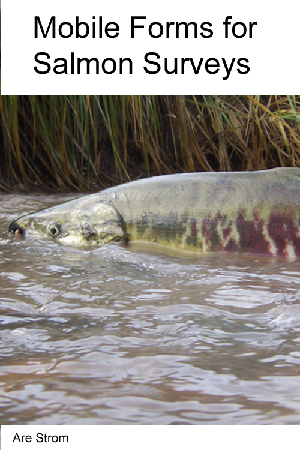

--- 
title: "Mobile forms for salmon surveys"
author: "Are Strom"
output: bookdown::gitbook
site: bookdown::bookdown_site
documentclass: book
bibliography: [book.bib, packages.bib]
biblio-style: apalike
link-citations: true
github-repo: arestrom/mf4ss
description: null
graphics: yes
coverpage: cover.png
---

# Welcome {-}

The growing popularity of mobile technology for data collection has increased both the types of data, and the volume of data, flowing from field to database. The advantages of mobile devices over paper forms are compelling. Mobile devices enable automated data capture using a wide assortment of sensors, including integrated GPS, barcode readers, cameras, PIT tag readers, temperature probes, and pH meters. 

In the past, data from a complete spawning ground survey would typically have been entered first in a field notebook, then transcribed to a 3x5 index card, and finally entered to an electronic spreadsheet. The electronic portion would rarely require more than a few kilobytes of memory. By contrast, mobile technology enables capturing a much *richer* set of data, possibly including binary data such as images or video. Consequently, storage requirements can grow to megabyte size and manual transcription is no longer practical. This, in turn, requires better systems to store, retrieve, and analyze an expanding flow of data. 

Making sure that data systems are well integrated is becoming increasingly important. At the Washington Department of Fish and Wildlife (WDFW), a new spawning ground database has been designed to absorb the increased flow, and diversity, of data on the back-end. Integration on the front-end is still a work in progress. This manual was motivated by the need for guidelines and standards at the mobile device end. The aim is two-fold: first, to provide simple examples to assist those just learning to build mobile forms, and second, to document data input elements needed to facilitate getting data securely moved from field to database.  

Building mobile forms can be a source of frustration, even for experienced IT staff. Although it is true that simple forms *can* be built quickly and easily, even moderately complex forms, such as those typically needed for spawning ground surveys, require a considerable amount of work. Once you start adding conditional logic and validation to your forms you *will* need to write some code. A formalized set of guidelines, along with step-by-step instructions, can help ease the pain. Standardizing the general structure of mobile forms can also help enable a smooth flow of data from field to back-end database. Although survey protocols vary from region to region, in general, they are similar enough that there is much to be gained from copying what works and learning from each other. 

To simplify the process of building mobile forms this manual takes a highly opinionated approach. As you gain experience in form building, feel free to customize as needed. But please keep in mind that core input elements need to be present in order to enable downloading and processing data so it can be integrated into our corporate *spawning ground* database. These core input elements will be emphasized in the sections that follow. 

Please consider contributing your own solutions, corrections, or edits to this manual. All source code is available at the project [GitHub repository](https://github.com/arestrom/mf4ss). It is written using the [bookdown](https://github.com/rstudio/bookdown) package [@R-bookdown]. See [bookdown: Authoring Books and Technical Documents with R Markdown](https://bookdown.org/yihui/bookdown/) for technical details on how to contribute [@xie2016]. 

Thanks to James Losee for the cover photo. 
